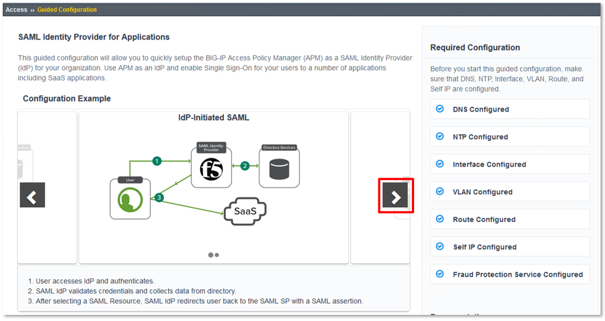
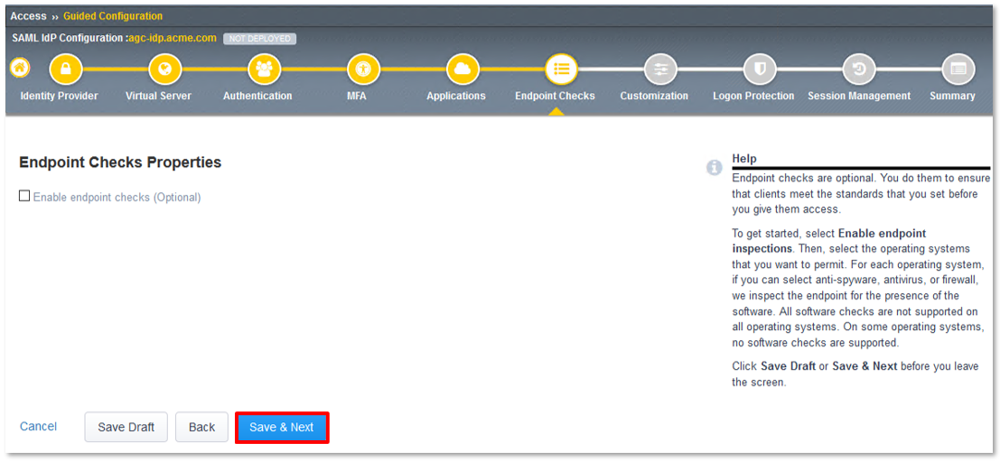

Lab 1: SAML Access Guided Configuration (AGC) Lab
=================================================

The purpose of this lab is to configure and test a SAML Federation Services.
This lab will be configured in two parts.  

In Part 1, Students will leverage Access Guided Configuration (AGC) to 
configure the various aspects of a SAML Identity Provider (IdP), import and bind
to a SAML Service Provider (SP) and test IdP-Initiated SAML Federation.

In Part 2, Students will leverage Access Guided Configuration (AGC) to 
configure the various aspects of a SAML Service Provider (SP), import and bind to
a SAML Idnetity Provider (IdP) and test SP-Initiated SAML Federation.

Objective:
----------

-  Gain an understanding of SAML Federation configurations and
   their component parts through Access Guided Configuration (AGC)

-  Gain an understanding of the access flow for IDP & SP Initiated SAML

Lab Requirements:
-----------------

-  All Lab requirements will be noted in the tasks that follow

-  Estimated completion time: 25-30 minutes

Lab 1 / Part 1 Tasks:
---------------------

TASK 1: Configure a SAML Identity Provider (IdP) via AGC 
~~~~~~~~~~~~~~~~~~~~~~~~~~~~~~~~~~~~~~~~~~~~~~~~~~~~~~~~

+----------------------------------------------------------------------------------------------+
| 1. Login to your lab provided **Virtual Edition BIG-IP**  by clicking **bigip1** in the      |
|                                                                                              |
|    shortcut toolbar.                                                                         |
+----------------------------------------------------------------------------------------------+
| |image001|                                                                                   |
+----------------------------------------------------------------------------------------------+

+----------------------------------------------------------------------------------------------+
| **Note:** *Many of the lab tasks will be required to be run from the jumphost. (To support*  |
|                                                                                              |
| *file imports and varisou other tasks.)*                                                     |
+----------------------------------------------------------------------------------------------+

+----------------------------------------------------------------------------------------------+
| 2. Begin by selecting: **Access -> Guided Configuration** in the left hand navigation menu.  |
+----------------------------------------------------------------------------------------------+
| |image002|                                                                                   |
+----------------------------------------------------------------------------------------------+

+----------------------------------------------------------------------------------------------+
| 3. Once **Guided Configuration** loads, click on **Federation** and then in the resulting    |
|                                                                                              |
|    **Federation** sub-menu click, **SAML Identity Provider Federation for Applications**.    |
+----------------------------------------------------------------------------------------------+
| |image003|                                                                                   |
+----------------------------------------------------------------------------------------------+

+----------------------------------------------------------------------------------------------+
| 4. In the resulting **SAML Identity Provider Federation for Applications** windows,          |
|                                                                                              |
|    review the **IdP-Initiated SAML flow** and then click the **right arrow**.                |
+----------------------------------------------------------------------------------------------+
| |image004|                                                                                   |
+----------------------------------------------------------------------------------------------+

+----------------------------------------------------------------------------------------------+
| 5. Review the **SP-Initiated SAML flow** and then scroll down to the bottom of the window.   |
+----------------------------------------------------------------------------------------------+
| |image005|                                                                                   |
+----------------------------------------------------------------------------------------------+

+----------------------------------------------------------------------------------------------+
| 6. Review the configuration objects to be created and the click **Next**.                    |
+----------------------------------------------------------------------------------------------+
| |image006|                                                                                   |
+----------------------------------------------------------------------------------------------+

TASK 2: Configure the Identity Provider
~~~~~~~~~~~~~~~~~~~~~~~~~~~~~~~~~~~~~~~

+----------------------------------------------------------------------------------------------+
| 1. In the **Identity Provider Properties** section, enter the following in the fields        |
|                                                                                              |
|    provided:                                                                                 |
|                                                                                              |
|    * In the **Configuration Name** field input **agc-idp.acme.com**.                         |
|                                                                                              |
|    * In the **Entity ID** field input **https://agc-idp.acme.com**.                          |
|                                                                                              |
| 2. In the **Assertion Properties** section, use the dropdowns to select the following:       |
|                                                                                              |
|    * For the **Signing Key** select **saml-agc-idp.acme.com**.                               |
|                                                                                              |
|    * For the **Signing Certificate** select **saml-agc-idp.acme.com**.                       |
+----------------------------------------------------------------------------------------------+
| |image007|                                                                                   |
+----------------------------------------------------------------------------------------------+

TASK 3: Configure the Virtual Server
~~~~~~~~~~~~~~~~~~~~~~~~~~~~~~~~~~~~

+----------------------------------------------------------------------------------------------+
| 1. In the **Virtual Server Properties** section, enter the following in the fields           |
|                                                                                              |
|    provided:                                                                                 |
|                                                                                              |
|    * In the **Destination Address** field input **10.1.10.102**.                             |
|                                                                                              |
|    * In the **Service Port** field input **443** **HTTPS**                                   |
|                                                                                              |
|    * In the **Redirect Port** field input **80** **HTTP**                                    |
|                                                                                              |
| 2. In the **Client SSL Profile** section, use the arrows to move only the                    |
|                                                                                              |
|    **wilcard.acme.com** profile to the right-hand column as shown.                           |
|                                                                                              |
| 3. Click **Save & Next**.                                                                    |
+----------------------------------------------------------------------------------------------+
| |image008|                                                                                   |
+----------------------------------------------------------------------------------------------+

TASK 4: Configure Authentication
~~~~~~~~~~~~~~~~~~~~~~~~~~~~~~~~

+----------------------------------------------------------------------------------------------+
| 1. In the **Authentication Properties** section, use the dropdowns to select the following:  |
|                                                                                              |
|    * For the **Choose Authentication Server Type** select **Active Directory**.              |
|                                                                                              |
|    * For the **Choose Authentication Server** select **f5lab.local**.                        |
|                                                                                              |
| 2. **Check** the **Active Directory Query Properties** checkbox.                             |
|                                                                                              |
| 3. Input **%{session.logon.last.username}** in **Search Filter** field.                      |
|                                                                                              |
| 4. In the **Required Attributes** section, use the arrows to move only the                   |
|                                                                                              |
|    **memberOf** attribute to the right-hand column as shown.                                 |
|                                                                                              |
| 5. Click **Save & Next**.                                                                    |
+----------------------------------------------------------------------------------------------+
| |image009|                                                                                   |
+----------------------------------------------------------------------------------------------+

TASK 5: Configure MFA
~~~~~~~~~~~~~~~~~~~~~

+----------------------------------------------------------------------------------------------+
| 1. Click **Save & Next**.                                                                    |
|                                                                                              |
| **Note:** *Multiple MFA options can be easily integrated with TMOS.*                         |
+----------------------------------------------------------------------------------------------+
| |image010|                                                                                   |
+----------------------------------------------------------------------------------------------+

TASK 6: Configure Applications
~~~~~~~~~~~~~~~~~~~~~~~~~~~~~~

+----------------------------------------------------------------------------------------------+
| 1. In the **Application Properties** section, use the dropdown to select **Metadata** for    |
|                                                                                              |
|    **Select method to configure your application**.                                          |
|                                                                                              |
| **Note:** *Multiple applications are available to be configured with more continually added* |
+----------------------------------------------------------------------------------------------+
| |image011|                                                                                   |
+----------------------------------------------------------------------------------------------+

+----------------------------------------------------------------------------------------------+
| 2. In the **Application Properties** section, click the **Choose File** button,  browse the  |
|                                                                                              |
|    **Jumphost** desktop and select the **sp_partner_com_metadata.xml** file.                 |
|                                                                                              |
| 3. For the **Application Name**, input **sp.partner.com**                                    |
|                                                                                              |
| 4. For the **Webtop Caption**, make sure the value is **sp.partner.com**                     |
|                                                                                              |
| 5. Click **Save & Next**.                                                                    |
+----------------------------------------------------------------------------------------------+
| |image012|                                                                                   |
+----------------------------------------------------------------------------------------------+

+----------------------------------------------------------------------------------------------+
| 6. Review the **Configured Application List** and then click **Save & Next**.                |
+----------------------------------------------------------------------------------------------+
| |image013|                                                                                   |
+----------------------------------------------------------------------------------------------+

TASK 7: Configure Endpoint Checks
~~~~~~~~~~~~~~~~~~~~~~~~~~~~~~~~~

+----------------------------------------------------------------------------------------------+
| 1. Click **Save & Next**.                                                                    |
|                                                                                              |
| **Note:** *Endpoints checks can also be configured to protect application access.  The*      |
|                                                                                              |
| *Access 302 Lab, hosted at this year's Agility will have additional details.*                |
+----------------------------------------------------------------------------------------------+
| |image014|                                                                                   |
+----------------------------------------------------------------------------------------------+

TASK 8: Configure Customization
~~~~~~~~~~~~~~~~~~~~~~~~~~~~~~~

+----------------------------------------------------------------------------------------------+
| 1. Review the Customization options, then scroll to the bottom of the window and click       |
|                                                                                              |
|    **Save & Next**.                                                                          |
|                                                                                              |
| **Note:** *Unlike iApps, Access basic customizations are part of AGC.*                       |
+----------------------------------------------------------------------------------------------+
| |image015|                                                                                   |
+----------------------------------------------------------------------------------------------+

TASK 9: Configure Logon Protection
~~~~~~~~~~~~~~~~~~~~~~~~~~~~~~~~~~

+----------------------------------------------------------------------------------------------+
| 1. Click **Save & Next**.                                                                    |
|                                                                                              |
| **Note:** *Logon Page Protection enables Datasafe to further protect logon pages and*        |
|                                                                                              |
| *protect against malicious in-browser attacks*.                                              |
+----------------------------------------------------------------------------------------------+
| |image016|                                                                                   |
+----------------------------------------------------------------------------------------------+

TASK 10: Configure Session Management
~~~~~~~~~~~~~~~~~~~~~~~~~~~~~~~~~~~~~

+----------------------------------------------------------------------------------------------+
| 1. Review the Session Managment settings, then scroll to the bottom of the window and click  |
|                                                                                              |
|    **Save & Next**.                                                                          |
+----------------------------------------------------------------------------------------------+
| |image017|                                                                                   |
+----------------------------------------------------------------------------------------------+

TASK 10: Review the Summary and Deploy
~~~~~~~~~~~~~~~~~~~~~~~~~~~~~~~~~~~~~~

+----------------------------------------------------------------------------------------------+
| 1. Review the Summary, then scroll to the bottom of the window and click **Deploy**.         |
+----------------------------------------------------------------------------------------------+
| |image018|                                                                                   |
+----------------------------------------------------------------------------------------------+

+----------------------------------------------------------------------------------------------+
| 2. The application is now deployed click **Finish**.                                         |
+----------------------------------------------------------------------------------------------+
| |image019|                                                                                   |
+----------------------------------------------------------------------------------------------+

+----------------------------------------------------------------------------------------------+
| 3. Review the Access Guided Confguration window, **Status** for **agc-idp.acme.com** is      |
|                                                                                              |
|    **DEPLOYED**.                                                                             |
+----------------------------------------------------------------------------------------------+
| |image020|                                                                                   |
+----------------------------------------------------------------------------------------------+

TASK: 11: Testing the SAML Identity Provider (IdP)
~~~~~~~~~~~~~~~~~~~~~~~~~~~~~~~~~~~~~~~~~~~~~~~~~~

+----------------------------------------------------------------------------------------------+
| 1. Open Firefox from the Jumphost desktop and click on the **AGC-IDP** link in the bookmark  |
|                                                                                              |
| toolbar.                                                                                     |
|                                                                                              |
| **Note:** *If you have issues, open Firefox in a Provate Window (Incognito/Safe Mode)*       |
+----------------------------------------------------------------------------------------------+
| |image021|                                                                                   |
+----------------------------------------------------------------------------------------------+

+----------------------------------------------------------------------------------------------+
| 2. Once the page loads, enter **user1** for username and **user1** for password  in the      |
|                                                                                              |
|    logon form and click the logon button.                                                    |
+----------------------------------------------------------------------------------------------+
| |image022|                                                                                   |
+----------------------------------------------------------------------------------------------+

+----------------------------------------------------------------------------------------------+
| 3. On the presented webtop, click the **sp.partner.com** link in the **Applications and**    |
|                                                                                              |
|    **Links** section.                                                                        |
+----------------------------------------------------------------------------------------------+
| |image023|                                                                                   |
+----------------------------------------------------------------------------------------------+
 
+----------------------------------------------------------------------------------------------+
| 4. The **Partner Application** will now open if successfully configured.  Navigate back to   |
|                                                                                              |
|    **F5 Dynamic Webtop** tab and click logout.                                               |
+----------------------------------------------------------------------------------------------+
| |image024|                                                                                   |
+----------------------------------------------------------------------------------------------+

+----------------------------------------------------------------------------------------------+
| 5. This concludes Part 1 of Lab1. Proceed to Part 2.                                         |
+----------------------------------------------------------------------------------------------+
| |image025|                                                                                   |
+----------------------------------------------------------------------------------------------+

Lab 1 / Part 2 Tasks:
---------------------

TASK 4: Configure the SAML SP Access Policy
~~~~~~~~~~~~~~~~~~~~~~~~~~~~~~~~~~~~~~~~~~~

Refer to the instructions and screen shots below:

+----------------------------------------------------------------------------------------------+
| 1. Begin by selecting: **Access** -> **Profiles/Policies** -> **Access Profiles**            |
|    **(Per-Session Policies)**                                                                |
|                                                                                              |
| 2. Click the **Create** button (far right)                                                   |
+----------------------------------------------------------------------------------------------+
| |image009|                                                                                   |
+----------------------------------------------------------------------------------------------+

+----------------------------------------------------------------------------------------------+
| 3. In the **New Profile** window, key in the following as shown:                             |
|                                                                                              |
|    -  **Name**: **app.f5demo.com-policy**                                                    |
|                                                                                              |
|    -  **Profile Type**: **All** (from drop down)                                             |
|                                                                                              |
|    -  **Profile Scope**: **Profile** (default)                                               |
|                                                                                              |
| 4. Scroll to the bottom of the **New Profile** window to the **Language Settings**           |
|                                                                                              |
| 5. Select **English** from the **Factory Built-in Languages** menu on the right and click    |
|                                                                                              |
|    the **Double Arrow (<<)**, then click the **Finished** button.                            |
+----------------------------------------------------------------------------------------------+
| |image010|                                                                                   |
+----------------------------------------------------------------------------------------------+
 
+----------------------------------------------------------------------------------------------+
| 6. From the **Access** -> **Profiles/Policies** -> **Access Profiles**                       |
|    **(Per-Session Policies)**,                                                               |
|                                                                                              |
|    click the **Edit** link on the previously created **app.f5demo.com-policy** line.         |
+----------------------------------------------------------------------------------------------+
| |image011|                                                                                   |
+----------------------------------------------------------------------------------------------+

+----------------------------------------------------------------------------------------------+
| 7. In the **Visual Policy Editor** window for the **/Common/app.f5demo.com-policy**, click   |
|                                                                                              |
|    the **Plus (+) Sign** between **Start** and **Deny**.                                     |
|                                                                                              |
| 8. In the pop-up dialogue box select the **Authentication** tab and then click the **Radio** |
|                                                                                              | 
|    **Button** next to **SAML Auth**. Once selected click the **Add Item** button.            |
+----------------------------------------------------------------------------------------------+
| |image012|                                                                                   |
|                                                                                              |
| |image013|                                                                                   |
+----------------------------------------------------------------------------------------------+
  
+----------------------------------------------------------------------------------------------+
| 9. In the **SAML Auth** configuration window, select **/Common/app.f5demo.com** from the     |
|                                                                                              |
|    **SAML Authentication**, **AAA Server** drop down menu.                                   |
|                                                                                              | 
| 10. Click the **Save** button at the bottom of the configuration window.                     |  
+----------------------------------------------------------------------------------------------+
| |image014|                                                                                   |
+----------------------------------------------------------------------------------------------+

+----------------------------------------------------------------------------------------------+
| 11. In the **Visual Policy Editor** select the **Deny** along the **Successful** branch      |
|                                                                                              |
|    following the **SAML Auth**                                                               |
|                                                                                              |
| 12. From the **Select Ending** dialogue box select the **Allow Radio Button** and then       |
|                                                                                              |
|    click **Save**.                                                                           |
+----------------------------------------------------------------------------------------------+
| |image015|                                                                                   |
+----------------------------------------------------------------------------------------------+

+----------------------------------------------------------------------------------------------+
| 13. In the **Visual Policy Editor** click the **Apply Access Policy** (top left) and close   |
|                                                                                              |
|    the **Visual Policy Editor**.                                                             |
|                                                                                              |
| *Note: Additional actions can be taken in the Per Session policy (Access Policy). The lab*   |
|                                                                                              |
| *is simply completing authentication. Other access controls can be implemented based on the* |
|                                                                                              |
| *use case*                                                                                   |
+----------------------------------------------------------------------------------------------+
| |image016|                                                                                   |
+----------------------------------------------------------------------------------------------+

TASK 5: Create the SP Virtual Server & Apply the SP Access Policy
~~~~~~~~~~~~~~~~~~~~~~~~~~~~~~~~~~~~~~~~~~~~~~~~~~~~~~~~~~~~~~~~~

Refer to the instructions and screen shots below:

+----------------------------------------------------------------------------------------------+
| 1. Begin by selecting: **Local Traffic** -> **Virtual Servers**                              |
|                                                                                              |
| 2. Click the **Create** button (far right)                                                   |   
+----------------------------------------------------------------------------------------------+
| |image017|                                                                                   |
+----------------------------------------------------------------------------------------------+

+----------------------------------------------------------------------------------------------+
| 3. In the **New Virtual Server** window, key in the following as shown:                      |
|                                                                                              |
|    -  **Name**: **app.f5demo.com**                                                           |
|                                                                                              |
|    -  **Destination Address/Mask**: **10.1.10.100**                                          |
|                                                                                              |
|    -  **Service Port**: **443**                                                              |
|                                                                                              |
|    -  **HTTP Profile:** **http** (drop down)                                                 |
|                                                                                              |
|    -  **SSL Profile (client):** **app.f5demo.com-clientssl**                                 |
|                                                                                              |
|    -  **Source Address Translation:**  **Auto Map**                                          |
|                                                                                              |
| 4. Scroll to the **Access Policy** section                                                   |
|                                                                                              |
|    -  **Access Profile**: **app.f5demo.com-policy**                                          |
|                                                                                              |
|    -  **Per-Request Policy:** **saml\_policy**                                               |
|                                                                                              |
| 5. Scroll to the Resource section                                                            |
|                                                                                              |
|    -  **Default Pool**: **app.f5demo.com\_pool**                                             |
|                                                                                              |
| 6. Scroll to the bottom of the configuration window and click **Finished**                   |
|                                                                                              |
| *Note: The use of the Per-Request Policy is to provide header injection and other controls.* |
|                                                                                              |
| *These will be more utilized later in the lab.*                                              |
+----------------------------------------------------------------------------------------------+
| |image018|                                                                                   |
|                                                                                              |
| |image019|                                                                                   | 
+----------------------------------------------------------------------------------------------+

TASK 6: Test the SAML SP
~~~~~~~~~~~~~~~~~~~~~~~~

Refer to the instructions and screen shots below:

+----------------------------------------------------------------------------------------------+
| 1. Using your browser from the Jump Host click on the provided bookmark or navigate to       |
|                                                                                              |
|    https://app.f5demo.com . The SAML SP that you have just configured.                       |
+----------------------------------------------------------------------------------------------+
| |image020|                                                                                   |
+----------------------------------------------------------------------------------------------+

+----------------------------------------------------------------------------------------------+
| 2. Did you successfully redirect to the IdP?                                                 |
|                                                                                              |
| 3. Login to the iDP, were you successfully authenticated? (use credentials provided in the   |
|                                                                                              |
|    Authentication Information section at the beginning of this guide)                        |
|                                                                                              |
|    -  **Username**: **user**                                                                 |
|                                                                                              |
|    -  **Password**: **Agility1**                                                             |
|                                                                                              |
| 4. After successful authentication, were you returned to the SAML SP?                        |
|                                                                                              |
| 5. Were you successfully authenticated (SAML)?                                               |
|                                                                                              |
| 6. Review your **Active Sessions** (**Access Overview** -> **Active Sessions**)              |
|                                                                                              |
| 7. Review your Access Report Logs (**Access** -> **Overview Access Reports**)                |
+----------------------------------------------------------------------------------------------+
| |image021|                                                                                   |
+----------------------------------------------------------------------------------------------+

.. |image001| image:: media/lab1-001.png
   :width: 4.5in
   :height: 0.74in

.. |image003| image:: media/lab1-003.png
   :width: 4.5in
   :height: 3.38in

.. |image006| image:: media/lab1-006.png
   :width: 4.5in
   :height: 1.15in

.. |image008| image:: media/lab1-008.png
   :width: 4.5in
   :height: 0.96in
.. |image009| image:: media/lab1-009.png
   :width: 4.5in
   :height: 1.69in
.. |image010| image:: media/lab1-010.png
   :width: 4.5in
   :height: 2.94in
.. |image011| image:: media/lab1-011.png
   :width: 4.5in
   :height: 0.80in

.. |image013| image:: media/lab1-013.png
   :width: 4.5in
   :height: 4.00in

.. |image016| image:: media/lab1-016.png
   :width: 4.5in
   :height: 1.54in

.. |image019| image:: media/lab1-019.png
   :width: 4.5in
   :height: 2.13in
.. |image020| image:: media/lab1-020.png
   :width: 4.5in
   :height: 1.01in
.. |image021| image:: media/lab1-021.png
   :width: 4.5in
   :height: 1.93in
.. |image022| image:: media/lab1-022.png
   :width: 4.5in
   :height: 1.29in

.. |image024| image:: media/lab1-024.png
   :width: 4.5in
   :height: 2.13in
.. |image025| image:: media/lab1-025.png
   :width: 4.5in
   :height: 1.01in
.. |image026| image:: media/lab1-026.png
   :width: 4.5in
   :height: 1.93in
 