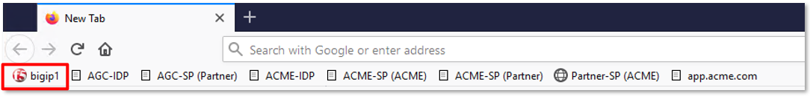
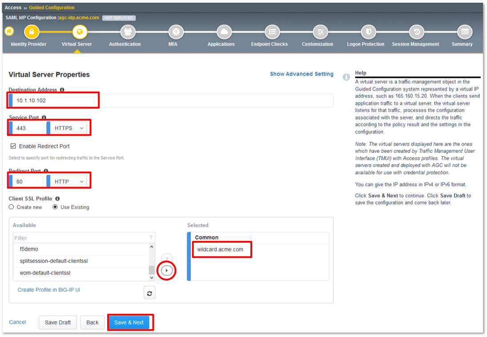
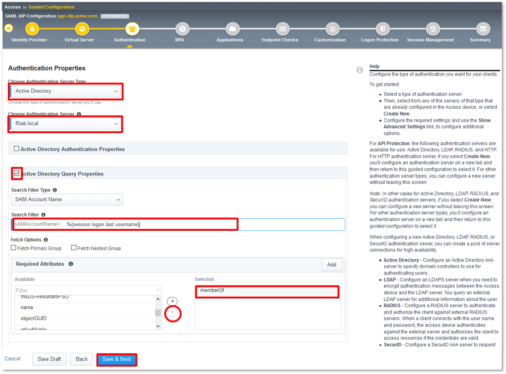
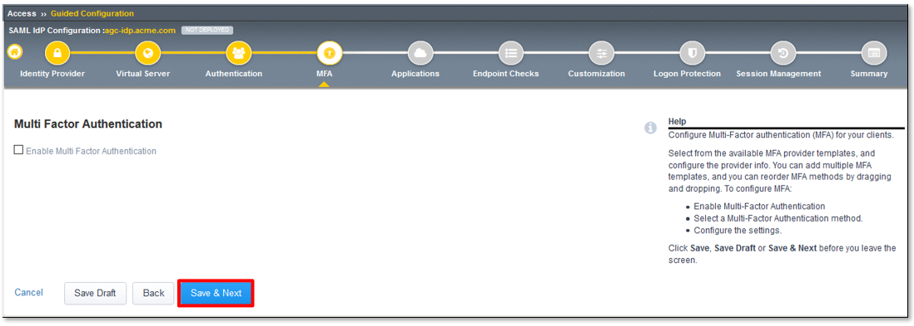
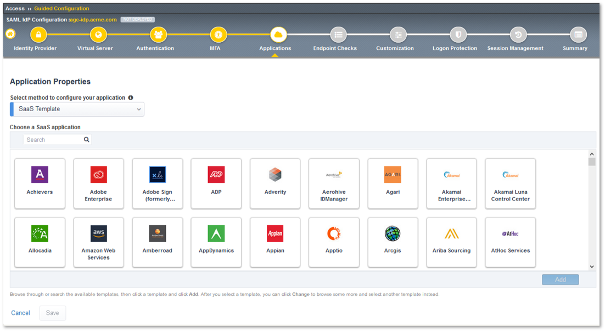
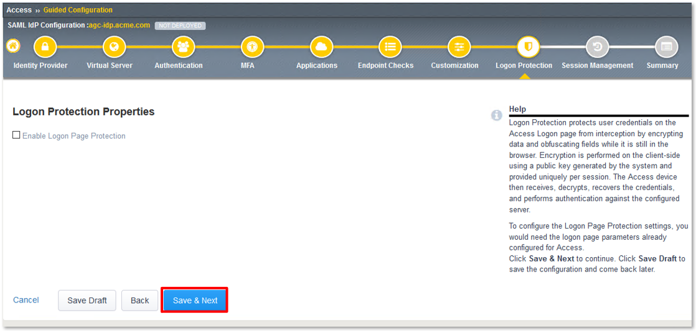
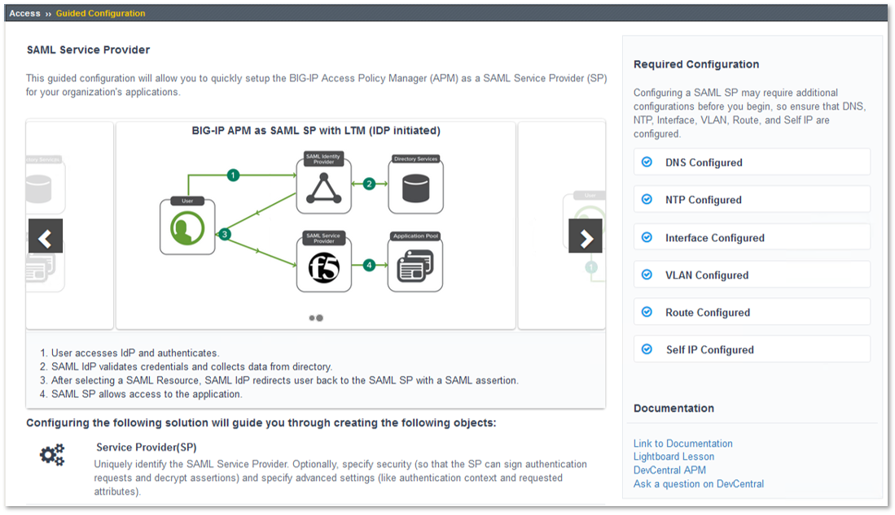

Lab 1: SAML Access Guided Configuration (AGC) Lab
=================================================

The purpose of this lab is to configure and test a SAML Federation Services.
This lab will be configured in two parts.  

In Part 1, Students will leverage Access Guided Configuration (AGC) to 
configure the various aspects of a SAML Identity Provider (IdP), import and bind
to a SAML Service Provider (SP) and test IdP-Initiated SAML Federation.

In Part 2, Students will leverage Access Guided Configuration (AGC) to 
configure the various aspects of a SAML Service Provider (SP), import and bind to
a SAML Identity Provider (IdP) and test SP-Initiated SAML Federation.

Objective:
----------

-  Gain an understanding of SAML Federation configurations and
   their component parts through Access Guided Configuration (AGC)

-  Gain an understanding of the access flow for IDP & SP Initiated SAML

Lab Requirements:
-----------------

-  All Lab requirements will be noted in the tasks that follow

-  Estimated completion time: 25-30 minutes

Lab 1 / Part 1 Tasks:
---------------------

TASK 1: Configure a SAML Identity Provider (IdP) via AGC 
~~~~~~~~~~~~~~~~~~~~~~~~~~~~~~~~~~~~~~~~~~~~~~~~~~~~~~~~

+----------------------------------------------------------------------------------------------+
| 1. Login to your lab provided **Virtual Edition BIG-IP**  by clicking **bigip1** in the      |
|                                                                                              |
|    shortcut toolbar.                                                                         |
+----------------------------------------------------------------------------------------------+
| |image001|                                                                                   |
+----------------------------------------------------------------------------------------------+

+----------------------------------------------------------------------------------------------+
| **Note:** *Many of the lab tasks will be required to be run from the jumphost. (To support*  |
|                                                                                              |
| *file imports and varisou other tasks.)*                                                     |
+----------------------------------------------------------------------------------------------+

+----------------------------------------------------------------------------------------------+
| 2. Navigate to **Access -> Guided Configuration** in the left-hand menu.                     |
+----------------------------------------------------------------------------------------------+
| |image002|                                                                                   |
+----------------------------------------------------------------------------------------------+

+----------------------------------------------------------------------------------------------+
| 3. Once **Guided Configuration** loads, click on **Federation** and then in the resulting    |
|                                                                                              |
|    **Federation** sub-menu click, **SAML Identity Provider Federation for Applications**.    |
+----------------------------------------------------------------------------------------------+
| |image003|                                                                                   |
+----------------------------------------------------------------------------------------------+

+----------------------------------------------------------------------------------------------+
| 4. In the resulting **SAML Identity Provider Federation for Applications** window,           |
|                                                                                              |
|    review the **IdP-Initiated SAML flow** and then click the **right arrow**.                |
+----------------------------------------------------------------------------------------------+
| |image004|                                                                                   |
+----------------------------------------------------------------------------------------------+

+----------------------------------------------------------------------------------------------+
| 5. Review the **SP-Initiated SAML flow** and then scroll down to the bottom of the window.   |
+----------------------------------------------------------------------------------------------+
| |image005|                                                                                   |
+----------------------------------------------------------------------------------------------+

+----------------------------------------------------------------------------------------------+
| 6. Review the configuration objects to be created and the click **Next**.                    |
+----------------------------------------------------------------------------------------------+
| |image006|                                                                                   |
+----------------------------------------------------------------------------------------------+

TASK 2: Configure the Identity Provider
~~~~~~~~~~~~~~~~~~~~~~~~~~~~~~~~~~~~~~~

+----------------------------------------------------------------------------------------------+
| 1. In the **Identity Provider Properties** section, enter the following values in the fields |
|                                                                                              |
|    provided:                                                                                 |
|                                                                                              |
|    * In the **Configuration Name** field input **agc-idp.acme.com**.                         |
|                                                                                              |
|    * In the **Entity ID** field input **https://agc-idp.acme.com**.                          |
|                                                                                              |
| 2. In the **Assertion Properties** section, use the dropdowns to select the following:       |
|                                                                                              |
|    * For the **Signing Key** select **saml-agc-idp.acme.com**.                               |
|                                                                                              |
|    * For the **Signing Certificate** select **saml-agc-idp.acme.com**.                       |
|                                                                                              |
| 3. Click **Save & Next**.                                                                    |
+----------------------------------------------------------------------------------------------+
| |image007|                                                                                   |
+----------------------------------------------------------------------------------------------+

TASK 3: Configure the Virtual Server
~~~~~~~~~~~~~~~~~~~~~~~~~~~~~~~~~~~~

+----------------------------------------------------------------------------------------------+
| 1. In the **Virtual Server Properties** section, enter the following values in the fields    |
|                                                                                              |
|    provided:                                                                                 |
|                                                                                              |
|    * In the **Destination Address** field input **10.1.10.102**.                             |
|                                                                                              |
|    * In the **Service Port** field input **443** **HTTPS**                                   |
|                                                                                              |
|    * In the **Redirect Port** field input **80** **HTTP**                                    |
|                                                                                              |
| 2. In the **Client SSL Profile** section, use the arrows to move only the                    |
|                                                                                              |
|    **wilcard.acme.com** profile to the right-hand column as shown.                           |
|                                                                                              |
| 3. Click **Save & Next**.                                                                    |
+----------------------------------------------------------------------------------------------+
| |image008|                                                                                   |
+----------------------------------------------------------------------------------------------+

TASK 4: Configure Authentication
~~~~~~~~~~~~~~~~~~~~~~~~~~~~~~~~

+----------------------------------------------------------------------------------------------+
| 1. In the **Authentication Properties** section, use the dropdowns to select the following:  |
|                                                                                              |
|    * For the **Choose Authentication Server Type** select **Active Directory**.              |
|                                                                                              |
|    * For the **Choose Authentication Server** select **f5lab.local**.                        |
|                                                                                              |
| 2. **Check** the **Active Directory Query Properties** checkbox.                             |
|                                                                                              |
| 3. Input **%{session.logon.last.username}** in **Search Filter** field.                      |
|                                                                                              |
| 4. In the **Required Attributes** section, use the arrows to move only the                   |
|                                                                                              |
|    **memberOf** attribute to the right-hand column as shown.                                 |
|                                                                                              |
| 5. Click **Save & Next**.                                                                    |
+----------------------------------------------------------------------------------------------+
| |image009|                                                                                   |
+----------------------------------------------------------------------------------------------+

TASK 5: Configure MFA
~~~~~~~~~~~~~~~~~~~~~

+----------------------------------------------------------------------------------------------+
| 1. Click **Save & Next**.                                                                    |
|                                                                                              |
| **Note:** *Multiple MFA options can be easily integrated with TMOS.*                         |
+----------------------------------------------------------------------------------------------+
| |image010|                                                                                   |
+----------------------------------------------------------------------------------------------+

TASK 6: Configure Applications
~~~~~~~~~~~~~~~~~~~~~~~~~~~~~~

+----------------------------------------------------------------------------------------------+
| 1. In the **Application Properties** section, use the dropdown to select **Metadata** for    |
|                                                                                              |
|    **Select method to configure your application**.                                          |
|                                                                                              |
| **Note:** *Multiple applications are available to be configured with more continually added* |
+----------------------------------------------------------------------------------------------+
| |image011|                                                                                   |
+----------------------------------------------------------------------------------------------+

+----------------------------------------------------------------------------------------------+
| 2. In the **Application Properties** section, click the **Choose File** button,  browse the  |
|                                                                                              |
|    **Jumphost** desktop and select the **sp_partner_com_metadata.xml** file.                 |
|                                                                                              |
| 3. For the **Application Name**, input **sp.partner.com**                                    |
|                                                                                              |
| 4. For the **Webtop Caption**, make sure the value is **sp.partner.com**                     |
|                                                                                              |
| 5. Click **Save & Next**.                                                                    |
+----------------------------------------------------------------------------------------------+
| |image012|                                                                                   |
+----------------------------------------------------------------------------------------------+

+----------------------------------------------------------------------------------------------+
| 6. Review the **Configured Application List** and then click **Save & Next**.                |
+----------------------------------------------------------------------------------------------+
| |image013|                                                                                   |
+----------------------------------------------------------------------------------------------+

TASK 7: Configure Endpoint Checks
~~~~~~~~~~~~~~~~~~~~~~~~~~~~~~~~~

+----------------------------------------------------------------------------------------------+
| 1. Click **Save & Next**.                                                                    |
|                                                                                              |
| **Note:** *Endpoints checks can also be configured to protect application access.  The*      |
|                                                                                              |
| *Access 302 Lab, hosted at this year's Agility will have additional details.*                |
+----------------------------------------------------------------------------------------------+
| |image014|                                                                                   |
+----------------------------------------------------------------------------------------------+

TASK 8: Configure Customization
~~~~~~~~~~~~~~~~~~~~~~~~~~~~~~~

+----------------------------------------------------------------------------------------------+
| 1. Review the Customization options, then scroll to the bottom of the window and click       |
|                                                                                              |
|    **Save & Next**.                                                                          |
|                                                                                              |
| **Note:** *Unlike iApps, Access basic customizations are part of AGC.*                       |
+----------------------------------------------------------------------------------------------+
| |image015|                                                                                   |
+----------------------------------------------------------------------------------------------+

TASK 9: Configure Logon Protection
~~~~~~~~~~~~~~~~~~~~~~~~~~~~~~~~~~

+----------------------------------------------------------------------------------------------+
| 1. Click **Save & Next**.                                                                    |
|                                                                                              |
| **Note:** *Logon Page Protection enables Datasafe to further protect logon pages and*        |
|                                                                                              |
| *protect against malicious in-browser attacks*.                                              |
+----------------------------------------------------------------------------------------------+
| |image016|                                                                                   |
+----------------------------------------------------------------------------------------------+

TASK 10: Configure Session Management
~~~~~~~~~~~~~~~~~~~~~~~~~~~~~~~~~~~~~

+----------------------------------------------------------------------------------------------+
| 1. Review the Session Managment settings, then scroll to the bottom of the window and click  |
|                                                                                              |
|    **Save & Next**.                                                                          |
+----------------------------------------------------------------------------------------------+
| |image017|                                                                                   |
+----------------------------------------------------------------------------------------------+

TASK 11: Review the Summary and Deploy
~~~~~~~~~~~~~~~~~~~~~~~~~~~~~~~~~~~~~~

+----------------------------------------------------------------------------------------------+
| 1. Review the Summary, then scroll to the bottom of the window and click **Deploy**.         |
+----------------------------------------------------------------------------------------------+
| |image018|                                                                                   |
+----------------------------------------------------------------------------------------------+

+----------------------------------------------------------------------------------------------+
| 2. The application is now deployed click **Finish**.                                         |
+----------------------------------------------------------------------------------------------+
| |image019|                                                                                   |
+----------------------------------------------------------------------------------------------+

+----------------------------------------------------------------------------------------------+
| 3. Review the Access Guided Confguration window, **Status** for **agc-idp.acme.com** is      |
|                                                                                              |
|    **DEPLOYED**.                                                                             |
+----------------------------------------------------------------------------------------------+
| |image020|                                                                                   |
+----------------------------------------------------------------------------------------------+

TASK: 12: Testing the SAML Identity Provider (IdP)
~~~~~~~~~~~~~~~~~~~~~~~~~~~~~~~~~~~~~~~~~~~~~~~~~~

+----------------------------------------------------------------------------------------------+
| 1. Open Firefox from the Jumphost desktop and click on the **AGC-IDP** link in the bookmark  |
|                                                                                              |
| toolbar.                                                                                     |
|                                                                                              |
| **Note:** *If you have issues, open Firefox in a Provate Window (Incognito/Safe Mode)*       |
+----------------------------------------------------------------------------------------------+
| |image021|                                                                                   |
+----------------------------------------------------------------------------------------------+

+----------------------------------------------------------------------------------------------+
| 2. Once the page loads, enter **user1** for username and **user1** for password  in the      |
|                                                                                              |
|    logon form and click the logon button.                                                    |
+----------------------------------------------------------------------------------------------+
| |image022|                                                                                   |
+----------------------------------------------------------------------------------------------+

+----------------------------------------------------------------------------------------------+
| 3. On the presented webtop, click the **sp.partner.com** link in the **Applications and**    |
|                                                                                              |
|    **Links** section.                                                                        |
+----------------------------------------------------------------------------------------------+
| |image023|                                                                                   |
+----------------------------------------------------------------------------------------------+
 
+----------------------------------------------------------------------------------------------+
| 4. The **Partner Application** will now open if successfully configured.  Navigate back to   |
|                                                                                              |
|    **F5 Dynamic Webtop** tab and click logout.                                               |
+----------------------------------------------------------------------------------------------+
| |image024|                                                                                   |
+----------------------------------------------------------------------------------------------+

+----------------------------------------------------------------------------------------------+
| 5. This concludes Part 1 of Lab1. Proceed to Part 2.                                         |
+----------------------------------------------------------------------------------------------+
| |image025|                                                                                   |
+----------------------------------------------------------------------------------------------+

Lab 1 / Part 2 Tasks:
---------------------

TASK 1: Configure a SAML Service Provider (SP) via AGC 
~~~~~~~~~~~~~~~~~~~~~~~~~~~~~~~~~~~~~~~~~~~~~~~~~~~~~~

+----------------------------------------------------------------------------------------------+
| 1. Navigate to **Access -> Guided Configuration** in the left-hand menu.                     |
|                                                                                              |
| 2. Once **Guided Configuration** loads, click on **Federation**.                             |
+----------------------------------------------------------------------------------------------+
| |image026|                                                                                   |
+----------------------------------------------------------------------------------------------+

+----------------------------------------------------------------------------------------------+
| 3. In the resulting **Federation** sub-menu click, **SAML Service Provider**.                |
+----------------------------------------------------------------------------------------------+
| |image027|                                                                                   |
+----------------------------------------------------------------------------------------------+

+----------------------------------------------------------------------------------------------+
| 4. In the resulting **SAML Service Provider** window, review the **{SP-Initiated) flow**     |
|                                                                                              |
|    and then click the **right arrow**.                                                       |
+----------------------------------------------------------------------------------------------+
| |image028|                                                                                   |
+----------------------------------------------------------------------------------------------+

+----------------------------------------------------------------------------------------------+
| 5. Review the **IdP-Initiated** flow and then scroll down to the bottom of the window.       |
+----------------------------------------------------------------------------------------------+
| |image029|                                                                                   |
+----------------------------------------------------------------------------------------------+

+----------------------------------------------------------------------------------------------+
| 6. Review the configuration objects to be created and the click **Next**.                    |
+----------------------------------------------------------------------------------------------+
| |image030|                                                                                   |
+----------------------------------------------------------------------------------------------+

TASK 2: Configure the Service Provider
~~~~~~~~~~~~~~~~~~~~~~~~~~~~~~~~~~~~~~

+----------------------------------------------------------------------------------------------+
| 1. In the **Service Provider Properties** section, enter the following values in the fields  |
|                                                                                              |
|    provided:                                                                                 |
|                                                                                              |
|    * In the **Configuration Name** field input **agc-sp.acme.com**.                          |
|                                                                                              |
|    * In the **Entity ID** field input **https://agc-sp.acme.com**.                           |
|                                                                                              |
| 2. In the **Security Settings** section, use the dropdowns to select the following:          |
|                                                                                              |
|    * For the **Signing Key** select **saml-agc-sp.acme.com**.                                |
|                                                                                              |
|    * For the **Signing Certificate** select **saml-agc-sp.acme.com**.                        |
|                                                                                              |
| 3. Click **Save & Next**.                                                                    |
+----------------------------------------------------------------------------------------------+
| |image031|                                                                                   |
+----------------------------------------------------------------------------------------------+

TASK 3: Configure the Virtual Server
~~~~~~~~~~~~~~~~~~~~~~~~~~~~~~~~~~~~

+----------------------------------------------------------------------------------------------+
| 1. In the **Virtual Server Properties** section, enter the following values in the fields    |
|                                                                                              |
|    provided:                                                                                 |
|                                                                                              |
|    * In the **Destination Address** field input **10.1.10.103**.                             |
|                                                                                              |
|    * In the **Service Port** field input **443** **HTTPS**                                   |
|                                                                                              |
|    * In the **Redirect Port** field input **80** **HTTP**                                    |
|                                                                                              |
| 2. In the **Client SSL Profile** section, use the arrows to move only the                    |
|                                                                                              |
|    **wilcard.acme.com** profile to the right-hand column as shown.                           |
|                                                                                              |
| 3. Click **Save & Next**.                                                                    |
+----------------------------------------------------------------------------------------------+
| |image032|                                                                                   |
+----------------------------------------------------------------------------------------------+

TASK 4: Configure External IdP Connector
~~~~~~~~~~~~~~~~~~~~~~~~~~~~~~~~~~~~~~~~

+----------------------------------------------------------------------------------------------+
| 1. In the **External Identity Provider Connector Settings** section, use the first dropdown  |
|                                                                                              |
|    to select the **Metadata**.                                                               |
|                                                                                              |
| 2. Click the **Choose File** button and then browse the **Jumphost** desktop and select the  |
|                                                                                              |
|    file **idp_partner_com_metadata.xml**.                                                    |
|                                                                                              |
| 4. In the **Name** field, input **idp.partner.com**                                          |
|                                                                                              |
| 4. Click **Save & Next**.                                                                    |
+----------------------------------------------------------------------------------------------+
| |image033|                                                                                   |
+----------------------------------------------------------------------------------------------+

TASK 5: Configure Pool
~~~~~~~~~~~~~~~~~~~~~~

+----------------------------------------------------------------------------------------------+
| 1. Click **Show Advanced Setting** in the upper right of the **Guided Configuration**.       |
|                                                                                              |
| 2. In the **Pool Properties** section, use the dropdown to select **Create New** for         |
|                                                                                              |
|    **Select a Pool**.                                                                        |
|                                                                                              |
| 3. In the **Health Monitors** section, use the arrows to move only the **/Common/http**      |
|                                                                                              |
|    health monitor to the right-hand column as shown.                                         |
|                                                                                              |
| 4. In the **Resource Properties** section, use the dropdown to select **Least Connections**  |
|                                                                                              |
|    **(member)** for **Load Balancing Method**.                                               |
|                                                                                              |
| 5. For the **Pool Servers** section, use the first dropdown to select **/Common/10.1.20.6**  |
|                                                                                              |
|    for **IP Address/Node Name**. Ensure port **80** and **HTTP** are set for the **Port**.   |
|                                                                                              |
| 6. Click **Save & Next**.                                                                    |
+----------------------------------------------------------------------------------------------+
| |image034|                                                                                   |
+----------------------------------------------------------------------------------------------+

TASK 6: Configure SSO
~~~~~~~~~~~~~~~~~~~~~

+----------------------------------------------------------------------------------------------+
| 1. In the **Single Sign-On Settings** section, check the **Enable Signle Sign-On** checkbox. |
|                                                                                              |
| 2. Use the **Selected Single Sign-On Type** dropdown to select **HTTP header-based**.        |
|                                                                                              |
| 3. In the **Username Source** field, ensure **session.saml.last.identity** is present.       |
|                                                                                              |
| 4. In the **SSO Headers** section, makes sure the following values are correct:              |
|                                                                                              |
|    * **Header Operation: replace**                                                           |
|                                                                                              |
|    * **Header Name: Authorization**                                                          |
|                                                                                              |
|    * **Header Value: %{session.saml.last.identity}**                                         |
|                                                                                              |
| 5. Scroll to the bottom of the window and Click **Save & Next**.                             |
+----------------------------------------------------------------------------------------------+
| |image035|                                                                                   |
+----------------------------------------------------------------------------------------------+

TASK 7: Configure Endpoint Checks
~~~~~~~~~~~~~~~~~~~~~~~~~~~~~~~~~

+----------------------------------------------------------------------------------------------+
| 1. Click **Save & Next**.                                                                    |
|                                                                                              |
| **Note:** *Endpoints checks can also be configured to protect application access.  The*      |
|                                                                                              |
| *Access 302 Lab, hosted at this year's Agility will have additional details.*                |
+----------------------------------------------------------------------------------------------+
| |image036|                                                                                   |
+----------------------------------------------------------------------------------------------+

TASK 8: Configure Session Management
~~~~~~~~~~~~~~~~~~~~~~~~~~~~~~~~~~~~

+----------------------------------------------------------------------------------------------+
| 1. Review the Session Managment settings, then scroll to the bottom of the window and click  |
|                                                                                              |
|    **Save & Next**.                                                                          |
+----------------------------------------------------------------------------------------------+
| |image037|                                                                                   |
+----------------------------------------------------------------------------------------------+

TASK 9: Review the Summary and Deploy
~~~~~~~~~~~~~~~~~~~~~~~~~~~~~~~~~~~~~

+----------------------------------------------------------------------------------------------+
| 1. Review the Summary, then scroll to the bottom of the window and click **Deploy**.         |
+----------------------------------------------------------------------------------------------+
| |image038|                                                                                   |
+----------------------------------------------------------------------------------------------+

+----------------------------------------------------------------------------------------------+
| 2. The application is now deployed click **Finish**.                                         |
+----------------------------------------------------------------------------------------------+
| |image039|                                                                                   |
+----------------------------------------------------------------------------------------------+

+----------------------------------------------------------------------------------------------+
| 3. Review the Access Guided Confguration window, **Status** for **agc-sp.acme.com** is       |
|                                                                                              |
|    **DEPLOYED**.                                                                             |
+----------------------------------------------------------------------------------------------+
| |image040|                                                                                   |
+----------------------------------------------------------------------------------------------+

TASK: 10: Testing the SAML Service Provider (SP)
~~~~~~~~~~~~~~~~~~~~~~~~~~~~~~~~~~~~~~~~~~~~~~~~

+----------------------------------------------------------------------------------------------+
| 1. Open Firefox from the Jumphost desktop and click on the **AGC-SP (Partner)** link in the  |
|                                                                                              |
|    bookmark toolbar.                                                                         |
|                                                                                              |
| **Note:** *If you have issues, open Firefox in a Provate Window (Incognito/Safe Mode)*       |
+----------------------------------------------------------------------------------------------+
| |image041|                                                                                   |
+----------------------------------------------------------------------------------------------+

+----------------------------------------------------------------------------------------------+
| 2. Once the page loads, enter **user1** for username and **user1** for password  in the      |
|                                                                                              |
|    **Partner Secure Logon** form and click the logon button.                                 |
+----------------------------------------------------------------------------------------------+
| |image042|                                                                                   |
+----------------------------------------------------------------------------------------------+

+----------------------------------------------------------------------------------------------+
| 3. The **Partner Application** will now open if successfully configured.                     |
+----------------------------------------------------------------------------------------------+
| |image043|                                                                                   |
+----------------------------------------------------------------------------------------------+

TASK 11: End of Lab1
~~~~~~~~~~~~~~~~~~~~

+----------------------------------------------------------------------------------------------+
| 1. This concludes Part 2 of Lab1. This concludes Lab1, feel free to review and test the      |
|                                                                                              |
|    configuration.                                                                            |
+----------------------------------------------------------------------------------------------+
| |image000|                                                                                   |
+----------------------------------------------------------------------------------------------+

.. |image000| image:: media/image001.png
   :width: 4.5in
   :height: 3.37in

.. |image002| image:: media/lab1-002.png
   :width: 4.5in
   :height: 3.37in

.. |image004| image:: media/lab1-004.png
   :width: 4.5in
   :height: 0.73in
.. |image005| image:: media/lab1-005.png
   :width: 4.5in
   :height: 3.37in

.. |image007| image:: media/lab1-007.png
   :width: 4.5in
   :height: 2.28in

.. |image012| image:: media/lab1-012.png
   :width: 4.5in
   :height: 1.12in

.. |image014| image:: media/lab1-014.png
   :width: 4.5in
   :height: 1.48in
.. |image015| image:: media/lab1-015.png
   :width: 4.5in
   :height: 1.12in

.. |image017| image:: media/lab1-017.png
   :width: 4.5in
   :height: 1.29in
.. |image018| image:: media/lab1-018.png
   :width: 4.5in
   :height: 5.46in

.. |image023| image:: media/lab1-023.png
   :width: 4.5in
   :height: 5.46in

.. |image041| image:: media/lab1-041.png
   :width: 4.5in
   :height: 1.93in

