Lab 3: OAuth and AzureAD Lab
============================

The purpose of this lab is to familiarize students with using APM in
conjunction with Microsoft AzureAD. In the lab, Microsoft AzureAD is
leveraged as an OAuth Authorization Server (AS) while BIG-IP, through
the APM configuration is leveraged as an OAuth Client/Resource Server. 
Students will configure various OAuth/OpenID aspects to log in to APM
front-ended application.

Objective:
----------

-  Gain additional understanding of F5 OAuth features & functionality

-  Deploy a standard configuration using F5 APM and Microsoft AzureAD    

Lab Requirements:
-----------------

-  All lab requirements will be noted in the tasks that follow

-  Estimated completion time: 25 minutes

Lab 3 Tasks:
------------

TASK 1: Create/Review New Application Registration
~~~~~~~~~~~~~~~~~~~~~~~~~~~~~~~~~~~~~~~~~~~~~~~~~~

+----------------------------------------------------------------------------------------------+
| **Note:** *The following Task 1 steps are to be "REVIEWED". Setting up a free Azure*         |
|                                                                                              |
| *developer account requires multiple steps (like the entry of billing information) which*    |
|                                                                                              |
| *are beyond the need and scope of this lab given the available time.  As such, the AzureAD*  |
|                                                                                              |
| *environment has been pre-configured for the lab exercises that follow.*                     |
+----------------------------------------------------------------------------------------------+

+----------------------------------------------------------------------------------------------+
| **[REVIEW]**                                                                                 |
|                                                                                              |
| 1. Log into the Microsoft Azure Dashboard and click  **Azure Active Directory** in the left  |
|                                                                                              |
|    navigation menu.                                                                          |
+----------------------------------------------------------------------------------------------+
| |image001|                                                                                   |
+----------------------------------------------------------------------------------------------+

+----------------------------------------------------------------------------------------------+
| **[REVIEW]**                                                                                 |
|                                                                                              |
| 2. Click on **App Registration** on the resulting menu and then **New Registration** in the  |
|                                                                                              |
|    horizontal menu.                                                                          |
+----------------------------------------------------------------------------------------------+
| |image035|                                                                                   |
+----------------------------------------------------------------------------------------------+

+----------------------------------------------------------------------------------------------+
| **[REVIEW]**                                                                                 |
|                                                                                              |
| 3. In the pop-up window for **Register an application**, enter the following values          | 
|                                                                                              |
|    * **Name:** **app.acme.com**                                                              |
|                                                                                              |
|    * **Supported account types:** **Accounts in this organizational directory only** (radio) | 
|                                                                                              |
|    * **Redirect URI:** **https://app.acme.com/oauth/client/redirect**                        |
|                                                                                              |
| 4. Click **Register**.                                                                       |
+----------------------------------------------------------------------------------------------+
| |image036|                                                                                   |
+----------------------------------------------------------------------------------------------+
 
+----------------------------------------------------------------------------------------------+
| **[REVIEW]**                                                                                 |
|                                                                                              |
| 5. In the resulting **app.acme.com** Registered App window, note & copy the **Application**  |
|                                                                                              |
|    **(client) ID** and **Directory (tenant) ID** as these will be used later in the setup.** |
+----------------------------------------------------------------------------------------------+
| |image037|                                                                                   |
+----------------------------------------------------------------------------------------------+

+----------------------------------------------------------------------------------------------+
| **[REVIEW]**                                                                                 |
|                                                                                              |
| 6. Click **Certificates & Secrets** in the left navigation window and then click **New**     |
|                                                                                              |
|    **client secret** in the **Client Secrets** section.                                      |
+----------------------------------------------------------------------------------------------+
| |image038|                                                                                   |
+----------------------------------------------------------------------------------------------+

+----------------------------------------------------------------------------------------------+
| **[REVIEW]**                                                                                 |
|                                                                                              |
| 7. In the **Add a client secret** pop-up window, enter the following values                  |
|                                                                                              |
| -  **Description:** **app.acme.com-secret**                                                  |
|                                                                                              |
| -  **Expires:** **In 2 Years**                                                               |
|                                                                                              |
| 8. Click **Add**.                                                                            |
+----------------------------------------------------------------------------------------------+
| |image039|                                                                                   |
+----------------------------------------------------------------------------------------------+

+----------------------------------------------------------------------------------------------+
| **[REVIEW]**                                                                                 |
|                                                                                              |
| 9. In the resulting window, note and copy the **Client Secret** in the **Client secrets**    |
|                                                                                              |
|    section of the window. This will be used later in the APM portion of the setup.           |
+----------------------------------------------------------------------------------------------+
| |image040|                                                                                   |
+----------------------------------------------------------------------------------------------+
 
+----------------------------------------------------------------------------------------------+
| **[REVIEW]**                                                                                 |
|                                                                                              |
| 10. In the left navigation menu select **API permissions**. In the updated panel note the    |
|                                                                                              |
|     assigned permissions.  These can be altered/expanded as needed based on needs.           |
+----------------------------------------------------------------------------------------------+
| |image041|                                                                                   |
+----------------------------------------------------------------------------------------------+

+----------------------------------------------------------------------------------------------+
| **[REVIEW]**                                                                                 |
|                                                                                              |
| 11. In the left navigation window, click **Manifest**.                                       |
|                                                                                              |
| 12. In the **Manifest** panel, edit the **groupMembershipClaims** line (line 12) from        |
|                                                                                              |
|     *null** to **“All”** (note quotes are required).                                         |
|                                                                                              |
| 13. Click **Save**.                                                                          |
|                                                                                              |
| **Note:** *You can also update groupMembershipClaims to be "SecurityGroup".*                 |
+----------------------------------------------------------------------------------------------+
| |image042|                                                                                   |
+----------------------------------------------------------------------------------------------+

TASK 2: Create OAuth Token Request
~~~~~~~~~~~~~~~~~~~~~~~~~~~~~~~~~~

+----------------------------------------------------------------------------------------------+
| 1. Create the **OAuth Request** by navigating to **Access** -> **Federation** ->             |
|                                                                                              |
|    **OAuth Client/Resource Server** -> **Request**.                                          |
+----------------------------------------------------------------------------------------------+
| |image001|                                                                                   |
+----------------------------------------------------------------------------------------------+

+----------------------------------------------------------------------------------------------+
| 2. Find the **AzureADTokenRequestByAuthzCode** row and click the **Copy** link.              |
|                                                                                              |
|    **Note:** *This should be the 6th row down.*                                              |
+----------------------------------------------------------------------------------------------+
| |image002|                                                                                   |
+----------------------------------------------------------------------------------------------+

+----------------------------------------------------------------------------------------------+
| 3. In the resulting **Copy Request** window, input **AzureADTokenRequest_ACME** for the      |
|                                                                                              |
|    **New Request Name** and then click the **Copy** button.                                  |
+----------------------------------------------------------------------------------------------+
| |image003|                                                                                   |
+----------------------------------------------------------------------------------------------+

+----------------------------------------------------------------------------------------------+
| 4. In the resulting **AzureADTokenRequest_ACME** window, click the                           |
|                                                                                              |
|    **custom | resource | <Enter_resource_name_here>** row in the **Request Parameters**      |
|                                                                                              |
|    section under **Request Settings** and then clieck the **Edit** button.                   |
|                                                                                              |
| 5. The edited row will now populate the *Parameter Type**, **Parameter Name** and            |
|                                                                                              |
|    **Parameter Value** fields.                                                               |
|                                                                                              |
| 6. Ensure the following values are in the indicated fields:                                  |
|                                                                                              |
|    * **Parameter Type:** **custom**                                                          |
|                                                                                              |
|    * **Parameter Name:** **resource**                                                        |
|                                                                                              |
|    * **Parameter Value:** **dd4bc4c7-2e90-41c9-9c41-b7eab5ab68b7**                           |
+----------------------------------------------------------------------------------------------+
| |image004|                                                                                   |
+----------------------------------------------------------------------------------------------+

+----------------------------------------------------------------------------------------------+
| 7. Once the value a verified correct, click the **Add** button which will move the values    |
|                                                                                              |
|    back to the **Request Parameters** section.                                               |
|                                                                                              |
| 8. Scroll to the bootom of the window and click the **Update** button.                       |
+----------------------------------------------------------------------------------------------+
| |image005|                                                                                   |
+----------------------------------------------------------------------------------------------+

TASK 3: Create OAuth Token Refresh Request
~~~~~~~~~~~~~~~~~~~~~~~~~~~~~~~~~~~~~~~~~~

+----------------------------------------------------------------------------------------------+
| 1. Return to the **OAuth Client/Resouce Server Request** list by navigating to **Access**    |
|                                                                                              |
|    -> **Federation** -> **OAuth Client/Resource Server** -> **Request**.                     |
|                                                                                              |
| **Note:** *You may still be at this window if you did not navigate away.*                    |
+----------------------------------------------------------------------------------------------+
| |image001|                                                                                   |
+----------------------------------------------------------------------------------------------+

+----------------------------------------------------------------------------------------------+
| 2. Find the **AzureADTokenRefreshRequest** row and click the **Copy** link.                  |
|                                                                                              |
|    **Note:** *This should be the 5th row down.*                                              |
+----------------------------------------------------------------------------------------------+
| |image006|                                                                                   |
+----------------------------------------------------------------------------------------------+

+----------------------------------------------------------------------------------------------+
| 3. In the resulting **Copy Request** window, input **AzureADTokenRefreshRequest_ACME** for   |
|                                                                                              |
|    the **New Request Name** and then click the **Copy** button.                              |
+----------------------------------------------------------------------------------------------+
| |image007|                                                                                   |
+----------------------------------------------------------------------------------------------+

+----------------------------------------------------------------------------------------------+
| 4. In the resulting **AzureADTokenRefreshRequest_ACME** window, click the                    |
|                                                                                              |
|    **custom | resource | <Enter_resource_name_here>** row in the **Request Parameters**      |
|                                                                                              |
|    section under **Request Settings** and then clieck the **Edit** button.                   |
|                                                                                              |
| 5. The edited row will now populate the *Parameter Type**, **Parameter Name** and            |
|                                                                                              |
|    **Parameter Value** fields.                                                               |
|                                                                                              |
| 6. Ensure the following values are in the indicated fields:                                  |
|                                                                                              |
|    * **Parameter Type:** **custom**                                                          |
|                                                                                              |
|    * **Parameter Name:** **resource**                                                        |
|                                                                                              |
|    * **Parameter Value:** **dd4bc4c7-2e90-41c9-9c41-b7eab5ab68b7**                           |
+----------------------------------------------------------------------------------------------+
| |image008|                                                                                   |
+----------------------------------------------------------------------------------------------+

+----------------------------------------------------------------------------------------------+
| 7. Once the value a verified correct, click the **Add** button which will move the values    |
|                                                                                              |
|    back to the **Request Parameters** section.                                               |
|                                                                                              |
| 8. Scroll to the bootom of the window and click the **Update** button.                       |
+----------------------------------------------------------------------------------------------+
| |image009|                                                                                   |
+----------------------------------------------------------------------------------------------+

+----------------------------------------------------------------------------------------------+
| 9. In the **OAuth Client/Resouce Server Request** list both the newly created requests       |
|                                                                                              |
|    should now be listed. **AzureADTokenRequest_ACME** & **AzureADTokenRefreshRequest_ACME**. |
+----------------------------------------------------------------------------------------------+
| |image010|                                                                                   |
+----------------------------------------------------------------------------------------------+

TASK 4: Create OAuth Provider
~~~~~~~~~~~~~~~~~~~~~~~~~~~~~

+----------------------------------------------------------------------------------------------+
| 1. Create the **OAuth Provider** by navigating to **Access** -> **Federation** ->            |
|                                                                                              |
|    **OAuth Client/Resource Server** -> **Provider** and clicking **Create**.                 |
+----------------------------------------------------------------------------------------------+
| |image011|                                                                                   |
+----------------------------------------------------------------------------------------------+

+----------------------------------------------------------------------------------------------+
| 2. In the resulting window, input the following values to create the Provider:               |
|                                                                                              |
| -  **Name**: **azure\_AD\_provider**                                                         |
|                                                                                              |
| -  **Type**: **AzureAD**  (select from dropdown)                                             |
|                                                                                              |
| -  **OpenID URI:** (replace **\_tennantID\_** with the following tenantID                    |
|                                                                                              |
|    **f5agilitydemogmail.onmicrosoft.com** )                                                  |
|                                                                                              |
| Resulting URI should be as follows:                                                          |
|                                                                                              |
| https://login.windows.net/f5agilitydemogmail.onmicrosoft.com/.well-known/openid-configuration|
|                                                                                              |
| 3. Click **Discover**.                                                                       |
|                                                                                              |
| 4. Scroll to the bottom of the window and then click **Save**.                               |
|                                                                                              |
| **Note:** *If using another account you can find you TenantID by navigating to the "Azure"*  |
|                                                                                              |
| *"Portal" and clicking "Azure Active Directory". The tenant ID is the "default directory"*   |
|                                                                                              |
| *The full name of the TenantID will be your *"TenantID.onmicrosoft.com".*                    |
+----------------------------------------------------------------------------------------------+
| |image012|                                                                                   |
+----------------------------------------------------------------------------------------------+

+----------------------------------------------------------------------------------------------+
| 9. In the **OAuth Client/Resouce Server Provider** list the newly created provider should    |
|                                                                                              |
|    now be listed. **azure_AD_provider**.                                                     |
+----------------------------------------------------------------------------------------------+
| |image013|                                                                                   |
+----------------------------------------------------------------------------------------------+

TASK 4: Create OAuth Server
~~~~~~~~~~~~~~~~~~~~~~~~~~~

+----------------------------------------------------------------------------------------------+
| 1. Create the **OAuth Server (Client)** by navigating to **Access** -> **Federation** ->     |
|                                                                                              |
|    **OAuth Client/Resource Server** -> **OAuth Server** and clicking the **+ (Plus Symbol)** |
|                                                                                              |
| **Note:** *If you miss clicking the plus sign, simply click the create button on the right.* |
+----------------------------------------------------------------------------------------------+
| |image014|                                                                                   |
+----------------------------------------------------------------------------------------------+

+----------------------------------------------------------------------------------------------+
| 2. In the resulting window, input the following values to create the Server:                 |
|                                                                                              |
| -  **Name:** **azure\_AD\_Server**                                                           |
|                                                                                              |
| -  **Mode:** **Client** (Select from dropdown)                                               |  
|                                                                                              |
| -  **Type:** **AzureAD** (Select from dropdown)                                              |
|                                                                                              |
| -  **OAuth Provider:** **azure\_AD\_provider** (Select from dropdown)                  |
|                                                                                              |
| -  **DNS Resolver:** **prebuilt\_dns\_resolver** (Select from dropdown)                      |
|                                                                                              |
| -  **Client ID:** **dd4bc4c7-2e90-41c9-9c41-b7eab5ab68b7**                                   |
|                                                                                              |
| -  **Client Secret:** **:RbLK?50]:aVZvomaZ6IC61_j/D=tXet**                                   |
|                                                                                              |
| -  **Client’s Server SSL Profile Name:** **serverssl** (Select from dropdown)                |
|                                                                                              |
| 3. Click **Finished**.                                                                       |
+----------------------------------------------------------------------------------------------+
| |image015|                                                                                   |
+----------------------------------------------------------------------------------------------+

+----------------------------------------------------------------------------------------------+
| 9. In the **OAuth Client/Resouce Server - OAuth Server** list the newly created provider     |
|                                                                                              |
|    should now be listed. **azure_AD_server**.                                                |
+----------------------------------------------------------------------------------------------+
| |image016|                                                                                   |
+----------------------------------------------------------------------------------------------+

TASK 5: Setup F5 Per Session Policy (Access Policy) 
~~~~~~~~~~~~~~~~~~~~~~~~~~~~~~~~~~~~~~~~~~~~~~~~~~~

+----------------------------------------------------------------------------------------------+
| 1. Edit the existing **azure_oauth** Per Session Policy by navigating to **Access** ->       |
|                                                                                              |
|    **Profile/Policies** -> **Access Profiles (Per Session Policies)**.                       |
|                                                                                              |
| 2. Locate the **azure_oauth** policy row (should be 4th row) and click the **Edit** link.    |
+----------------------------------------------------------------------------------------------+
| |image017|                                                                                   |
+----------------------------------------------------------------------------------------------+

+----------------------------------------------------------------------------------------------+
| 3. In the resulting Visual Policy Editor window for the **azure_oauth** policy, click the    |
|                                                                                              |
|    **+ (Plus Symbol)** on the **fallback** branch between **Start** and **Allow**.           |
+----------------------------------------------------------------------------------------------+
| |image018|                                                                                   |
+----------------------------------------------------------------------------------------------+

+----------------------------------------------------------------------------------------------+
| 4. In the resulting pop-up window, click the **Authentication** tab and then click the radio |
|                                                                                              |
|    button for **OAuth Client**.                                                              |
|                                                                                              |
| 5. Scroll to the bottom of the window and click **Add Item**.                                |
+----------------------------------------------------------------------------------------------+
| |image019|                                                                                   |
+----------------------------------------------------------------------------------------------+

+----------------------------------------------------------------------------------------------+
| 9. In the ***OAuth\_Client*** window enter the following values as shown:                    |
|                                                                                              |
| -  **Server:** **/Common/azure\_AD\_server** (Select from dropdown)                          |
|                                                                                              |
| -  **Grant Type:** **Authorization code** (Select from dropdown)                             |
|                                                                                              |
| -  **OpenID Connect:** **Enabled** (Select from dropdown)                                    |
|                                                                                              |
| -  **OpenID Connect Flow Type:** **Authorization code** (Select from dropdown)               |
|                                                                                              |
| -  **Authentication Redirect Request:** **/Common/AzureADAuthRedirectRequest**  (dropdown)   |
|                                                                                              |
| -  **Token Request:** **/Common/AzureADTokenRequest_ACME**                                   |
|                                                                                              |
| -  **Refresh Token Request:** **/Common/AzureADTokenRefreshRequest_ACME** (dropdown)         |
|                                                                                              |
| -  **OpenID Connect UserInfo Request:** **None** (Select from dropdown)                      |
|                                                                                              |
| -  **Redirection URI:** **https://%{session.server.network.name}/oauth/client/redirect**     |
|                                                                                              |
| 10. Click **Save**.                                                                          |
+----------------------------------------------------------------------------------------------+
| |image020|                                                                                   |
+----------------------------------------------------------------------------------------------+

YOU ARE HERE ....

+----------------------------------------------------------------------------------------------+
| 11. Click on the **Deny** link, in the **Select Binding**, select the **Allow** radio button |
|                                                                                              |
|    and click **Save**.                                                                       |
+----------------------------------------------------------------------------------------------+
| |image124|                                                                                   |
+----------------------------------------------------------------------------------------------+

+----------------------------------------------------------------------------------------------+
| 12. Click on the **Apply Access Policy** link in the top left-hand corner.                   |
|                                                                                              |
| *Note: Additional actions can be taken in the Per Session policy (Access Policy). The lab*   |
|                                                                                              |
| *is simply completing authorization. Other access controls can be implemented based*         |
|                                                                                              |
| *on the use case.*                                                                           |
+----------------------------------------------------------------------------------------------+
| |image125|                                                                                   |
+----------------------------------------------------------------------------------------------+

TASK 6: Associate Access Policy to Virtual Server 
~~~~~~~~~~~~~~~~~~~~~~~~~~~~~~~~~~~~~~~~~~~~~~~~~

Refer to the instructions and screen shots below:

+----------------------------------------------------------------------------------------------+
| 1. Navigate to **Local Traffic** -> **Virtual Servers** -> **Virtual Server List** and       |
|                                                                                              |
|    click on the **app.f5demo.com** Virtual Server link                                       |
|                                                                                              |
| 2. Scroll to the **Access Policy** section.                                                  |
+----------------------------------------------------------------------------------------------+
| |image126|                                                                                   |
+----------------------------------------------------------------------------------------------+

+----------------------------------------------------------------------------------------------+
| 3. Use the **Access Profile** drop down to change the **Access Profile** to                  |
|                                                                                              |
|    **AzureAD\_OAuth**.                                                                       |
|                                                                                              |
| 4. Use the **Per-Request Policy** drop down to change the **Per-Request Policy** to          |
|                                                                                              |
|    **AzureAD\_oauth\_policy**.                                                               |
|                                                                                              |
| 5. Scroll to the bottom of the **Virtual Server** configuration and click **Update**.        |
+----------------------------------------------------------------------------------------------+
| |image127|                                                                                   |
+----------------------------------------------------------------------------------------------+

TASK 7: Test app.f5demo.com
~~~~~~~~~~~~~~~~~~~~~~~~~~~

Refer to the instructions and screen shots below:

+----------------------------------------------------------------------------------------------+
| 1. Navigate in your provided browser to **https://app.f5demo.com**                           |
+----------------------------------------------------------------------------------------------+
| |image128|                                                                                   |
+----------------------------------------------------------------------------------------------+

+----------------------------------------------------------------------------------------------+
| 2. Authenticate with the following AzureAD account:                                          |
|                                                                                              |
| -  **Username:** **demouser@f5agilitydemogmail.onmicrosoft.com**                             |
|                                                                                              |
| -  **Password:** **f5d3m0u$3r**                                                              |
+----------------------------------------------------------------------------------------------+
| |image129|                                                                                   |
+----------------------------------------------------------------------------------------------+

+----------------------------------------------------------------------------------------------+
| 3. Did you successfully redirect to the AzureAD?                                             |
|                                                                                              |
| 4. After successful authentication, were you returned to the app.f5demo.com?                 |
|                                                                                              |
| 5. Did you successfully pass your OAuth Token?                                               |
+----------------------------------------------------------------------------------------------+
| |image130|                                                                                   |
+----------------------------------------------------------------------------------------------+

TASK 8: Per Request Policy Controls
~~~~~~~~~~~~~~~~~~~~~~~~~~~~~~~~~~~

Refer to the instructions and screen shots below:

+----------------------------------------------------------------------------------------------+
| 1. As in the prior lab, you can experiment with Per Request Policy controls. In the          |
|                                                                                              |
| application page for **https://app.f5demo.com** click the **Admin Link** shown.              |
+----------------------------------------------------------------------------------------------+
| |image131|                                                                                   |
+----------------------------------------------------------------------------------------------+

+----------------------------------------------------------------------------------------------+
| 2. You will receive an **Access to this page is blocked** (customizable) message with a      |
|                                                                                              |
|    reference. You have been blocked because you do not have access on a per request basis.   |
|                                                                                              |
| 3. Press the **Back** button in your browser to return to **https://app.f5demo.com**.        |
+----------------------------------------------------------------------------------------------+
| |image132|                                                                                   |
+----------------------------------------------------------------------------------------------+

+----------------------------------------------------------------------------------------------+
| 4. Navigate to **Local Traffic** -> **iRules** -> **Datagroup List** and click on the        |
|                                                                                              |
|    **Allowed\_Users** datagroup.                                                             |
|                                                                                              |
| 5. Enter your **demouser@f5agilitydemogmail.onmicrosoft.com** used for this lab as the       |
|                                                                                              |
|    **String** value.                                                                         |
|                                                                                              |
| 6. Click **Add** then Click **Update**.                                                      |
|                                                                                              |
| *Note: We are using a DataGroup control to minimize lab resources and steps. AD or LDAP      |
|                                                                                              |
| *Group memberships, Session variables, other user attributes and various other access*       |
|                                                                                              |
| *control mechanisms can be used to achieve similar results.*                                 |
+----------------------------------------------------------------------------------------------+
| |image133|                                                                                   |
+----------------------------------------------------------------------------------------------+

+----------------------------------------------------------------------------------------------+
| 7. You should now be able to successfully to access the Admin Functions by clicking on the   |
|                                                                                              |
|    Admin Link.                                                                               |
|                                                                                              |
| *Note: Per Request Policies are dynamic and do not require the same “Apply Policy” action*   |
|                                                                                              |
| *as Per Session Policies*.                                                                   |
+----------------------------------------------------------------------------------------------+
| |image134|                                                                                   |
+----------------------------------------------------------------------------------------------+

+----------------------------------------------------------------------------------------------+
| 8. To review the Per Request Policy, navigate to ***Access** -> **Profiles/Policies** ->     |
|                                                                                              |
|    **Per Request Policies** and click on the Edit link for the **AzureAD\_oauth\_policy**.   |
+----------------------------------------------------------------------------------------------+
| |image135|                                                                                   |
+----------------------------------------------------------------------------------------------+
 
+----------------------------------------------------------------------------------------------+
| 9. The various Per-Request-Policy actions can be reviewed.                                   |
|                                                                                              |
| *Note: Other actions like Step-Up Auth controls can be performed in a Per-Request Policy*    |
+----------------------------------------------------------------------------------------------+
| |image136|                                                                                   |
+----------------------------------------------------------------------------------------------+

TASK 9: Review OAuth Results 
~~~~~~~~~~~~~~~~~~~~~~~~~~~~

Refer to the instructions and screen shots below:

+----------------------------------------------------------------------------------------------+
| 1. Review your Active Sessions (**Access** -> **Overview** -> **Active Sessions**).          |
|                                                                                              |
| 2. You can review Session activity or session variable from this window or kill the          |
|                                                                                              |
|    selected Session.                                                                         |
+----------------------------------------------------------------------------------------------+
| |image137|                                                                                   |
+----------------------------------------------------------------------------------------------+

+----------------------------------------------------------------------------------------------+
| 3. Review your Access Report Logs (**Access** -> **Overview** -> **Access Reports**).        | 
+----------------------------------------------------------------------------------------------+
| |image138|                                                                                   |
+----------------------------------------------------------------------------------------------+

+----------------------------------------------------------------------------------------------+
| 4. In the **Report Parameters window** click **Run Report**.                                 |
+----------------------------------------------------------------------------------------------+
| |image139|                                                                                   |
+----------------------------------------------------------------------------------------------+

+----------------------------------------------------------------------------------------------+
| 5. Look at the **SessionID** report by clicking the **Session ID** Link.                     |
+----------------------------------------------------------------------------------------------+
| |image140|                                                                                   |
+----------------------------------------------------------------------------------------------+

+----------------------------------------------------------------------------------------------+
| 6. Look at the **Session Variables** report by clicking the **View Session Variables** link. |
|                                                                                              |
|    Pay attention to the OAuth Variables.                                                     |
|                                                                                              |
| *Note: Any of these session variables can be used to perform further actions to improve*     |
|                                                                                              |
| *security or constrain access with logic in the Per-Session or Per Request VPE policies*     |
|                                                                                              |
| *or iRules/iRulesLX.*                                                                        |
+----------------------------------------------------------------------------------------------+
| |image141|                                                                                   |
+----------------------------------------------------------------------------------------------+

+----------------------------------------------------------------------------------------------+
| 7. Review your Access Report Logs (**Access** -> **Overview** -> **OAuth Reports** ->        |  
|                                                                                              |
|    **Client/Resource Server**).                                                              |
+----------------------------------------------------------------------------------------------+
| |image142|                                                                                   |
+----------------------------------------------------------------------------------------------+

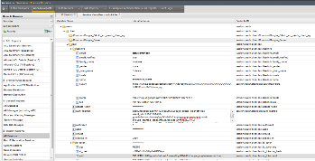
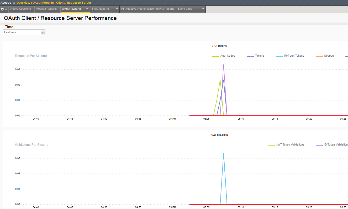
.. |image99| image:: media/image101.png
   :width: 3.53540in
   :height: 2.21472in
.. |image100| image:: media/image102.png
   :width: 3.57743in
   :height: 1.86503in
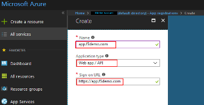
.. |image102| image:: media/image104.png
   :width: 3.50084in
   :height: 1.84049in
.. |image103| image:: media/image105.png
   :width: 3.46012in
   :height: 2.15172in
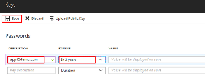
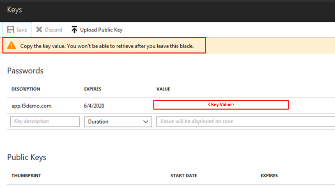
.. |image106| image:: media/image108.png
   :width: 3.42975in
   :height: 1.95950in
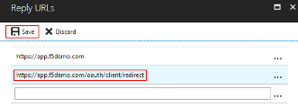
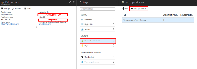
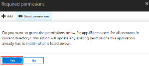
.. |image110| image:: media/image112.png
   :width: 3.21285in
   :height: 2.38037in
.. |image111| image:: media/image113.png
   :width: 3.49868in
   :height: 1.73941in
.. |image112| image:: media/image114.png
   :width: 3.57223in
   :height: 0.49387in
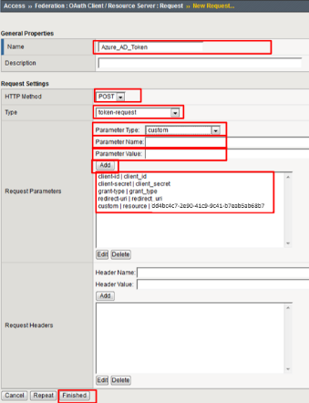
.. |image114| image:: media/image116.png
   :width: 3.50920in
   :height: 1.09553in
.. |image115| image:: media/image117.png
   :width: 3.48005in
   :height: 4.92024in
.. |image116| image:: media/image118.png
   :width: 3.39641in
   :height: 2.21472in
.. |image117| image:: media/image119.png
   :width: 3.58282in
   :height: 0.63933in
.. |image118| image:: media/image120.png
   :width: 3.52761in
   :height: 3.06445in
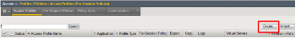
.. |image120| image:: media/image121.png
   :width: 3.52888in
   :height: 2.83435in
.. |image121| image:: media/image122.png
   :width: 3.52578in
   :height: 0.74560in
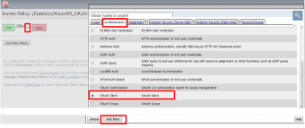
.. |image123| image:: media/image124.png
   :width: 3.56442in
   :height: 1.69631in
.. |image124| image:: media/image125.png
   :width: 3.46736in
   :height: 1.11639in
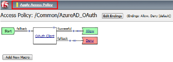
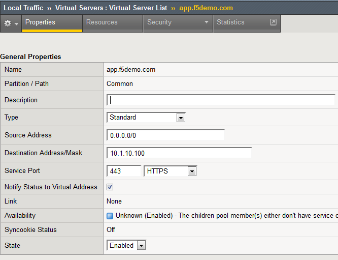
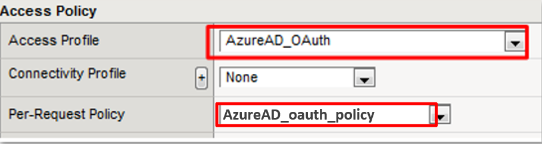
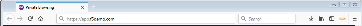
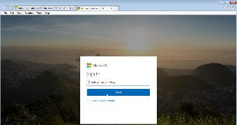
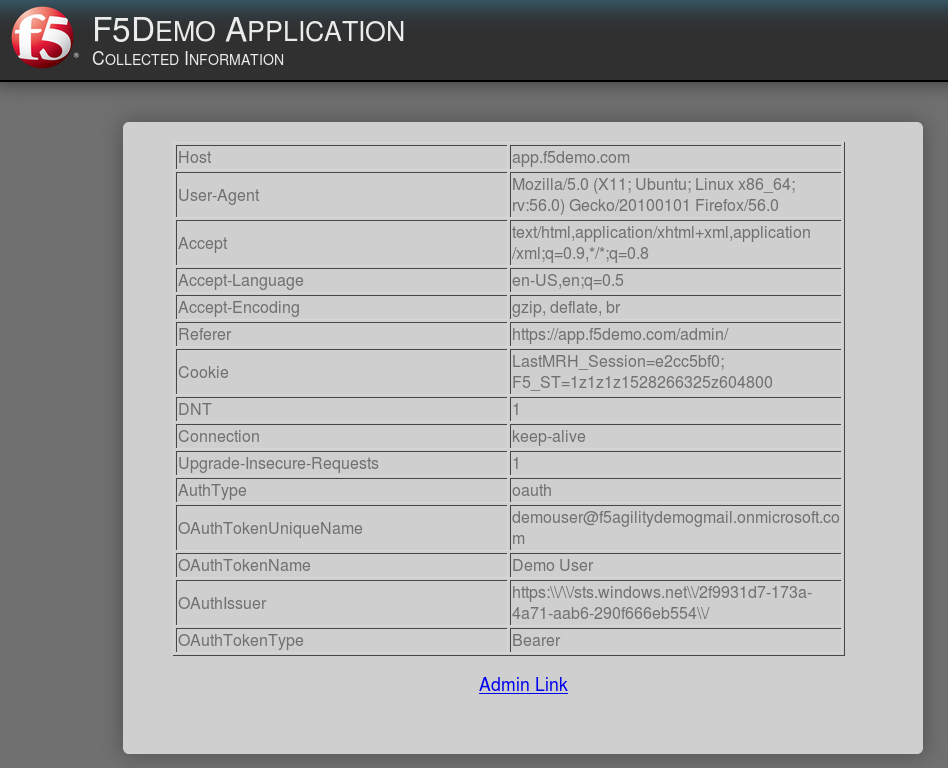
.. |image131| image:: media/image130.png
   :width: 2.82477in
   :height: 2.26623in
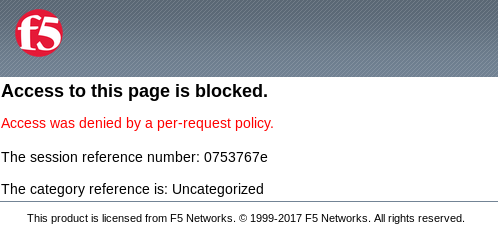
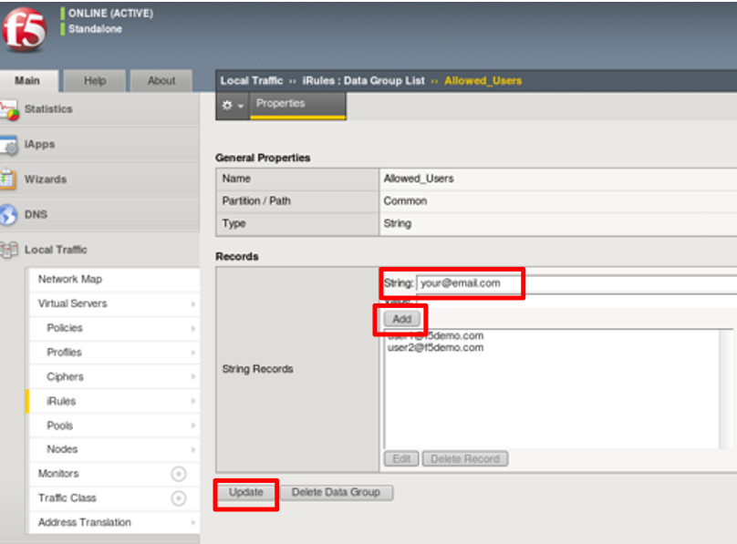
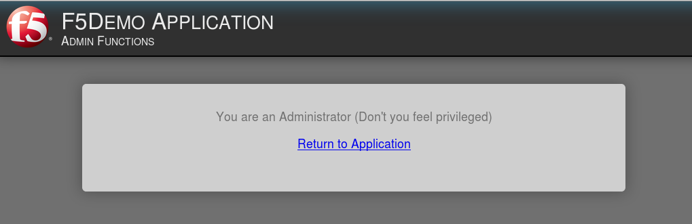
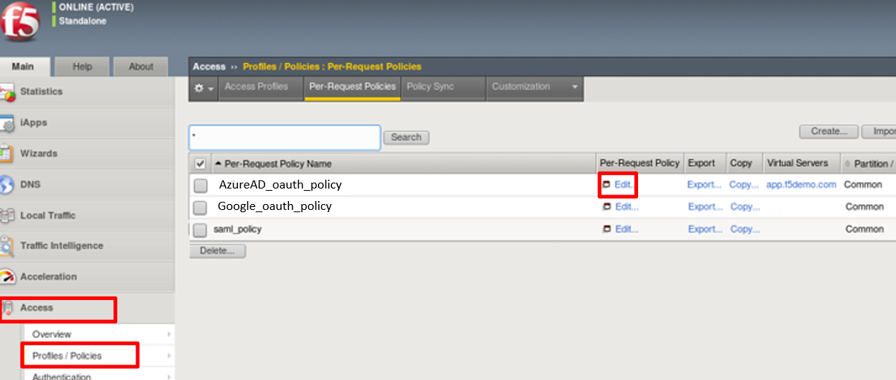
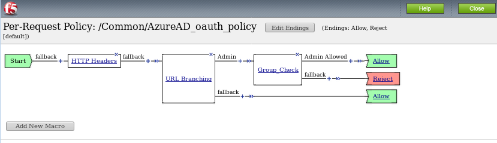
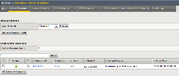
.. |image138| image:: media/image134.png
   :width: 2.18483in
   :height: 1.62069in
.. |image139| image:: media/image135.png
   :width: 1.99074in
   :height: 0.45516in
.. |image140| image:: media/image136.png
   :width: 1.98052in
   :height: 0.89862in
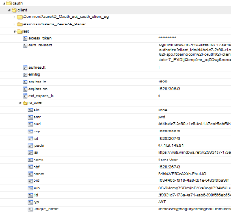
.. |image142| image:: media/image138.png
   :width: 3.56993in
   :height: 1.64660in
.. |image143| image:: media/image139.png
   :width: 2.84352in
   :height: 1.33129in
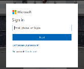
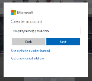
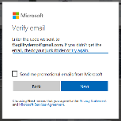
